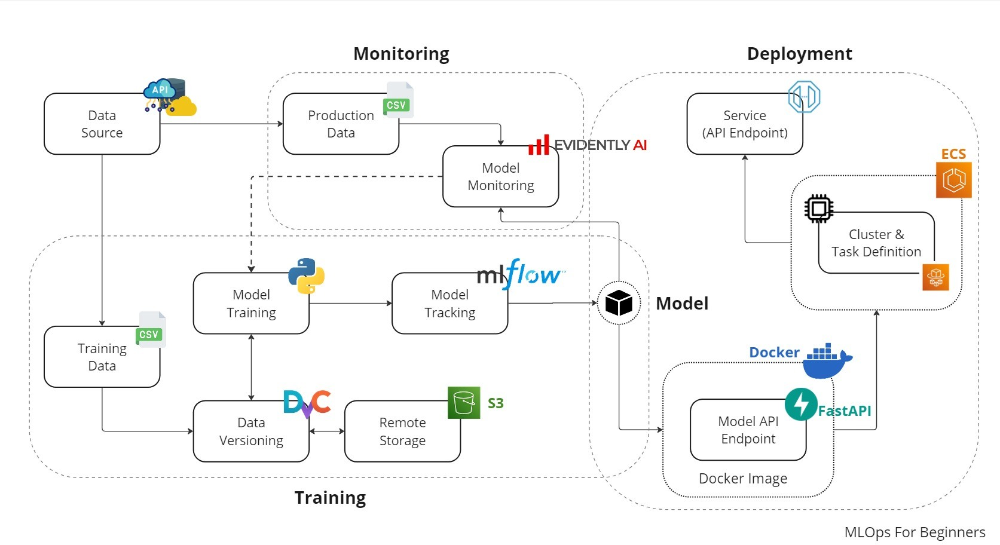

# Insurance-Cross-Sell-MLOps-Project-
[](https://github.com/daameya/Insurance-Cross-Sell-MLOps-Project) [](https://medium.com/@1998ameya)


The goal of this project is to predict which customers are most likely to purchase additional insurance products using a machine learning model.

## Diagram
Below is the architecture diagram that illustrates the flow of the project from data ingestion to model deployment:


## Get Started
To get started with the project, follow the steps below:

#### 1. Clone the Repository
Clone the project repository from GitHub:
```bash
git clone https://github.com/daameya/Insurance-Cross-Sell-MLOps-Project.git
```
```bash
cd Insurance-Cross-Sell-MLOps-Project
```
#### 2. Set Up the Environment
Ensure you have Python 3.11 installed. Create a virtual environment and install the necessary dependencies:
```bash
python -m venv venv
source venv/bin/activate  # On Windows: venv\Scripts\activate
pip install -r requirements.txt
```